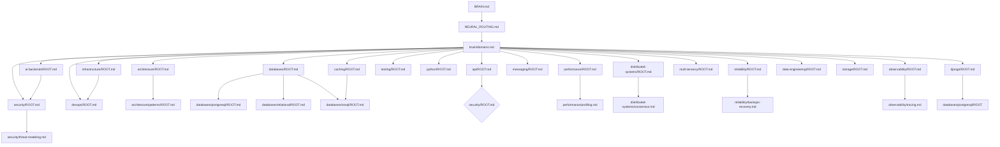

# brain/graph.md

Central neuron graph. **This is canonical.** Directory layout organizes, but the graph below is the real topology. Every neuron's own header repeats its local connections; this file holds the global view.

## Global graph (mermaid only)



## Edge inventory — primary links

(Full relationship type vocabulary in `brain/relationships.md`.)

### Databases
```
database.postgresql
  ├── generalizes→ database.relational
  ├── specializes→ (indexing, transactions, mvcc, replication, partitioning)
  ├── influences→ performance.database
  ├── integrates→ django.orm
  ├── observes→ observability.database
  ├── protects← security.data => cryptography (transport, at rest)
```

### API
```
api.rest ───updates──> api.error-design
api.rest ───idempotency──> distributed-systems.idempotency
api.webhooks ───security→ security.webhooks (signatures)
api.websockets ───real-time scope──> architecture.patterns.real-time
```

### Distributed
```
distributed.consistency ←──> cap theory
distributed.saga ───coordinates──> database.transactions
distributed.outbox ───needs──> database (transactional outbox) + queue
distributed.circuit-breaker ←─── performance (backpressure)
```

### Security Guardian crossing
```
security.authentication ───→ api.rest (auth flows)
security.authorization (object-level) ───→ api (IDOR prevention)
security.data-integrity ───→ cryptography.md
security.multi-tenancy ───isolation──→ multi-tenancy
```

### Caching
```
cache ───reduces──> performance.latency (measured)
cache ───adds──> cache.invalidation complexity
cache ───risk──> consistency staleness
```

### AI backends
```
ai.rag ───embeddings─→ vector-db (nosql/vector-databases.md)
ai.agents ───tool-calling─→ security (prompt injection)
ai.semantic-cache ───units──> caching/strategies.md
```

## How to walk this graph

1. Identify the region from `domains.md`
2. Open its ROOT neuron (activation rules)
3. Follow children; hop cross-domain only when a link is *labeled* with a causal relevance to the task.
4. After answering, update `research/index.md` if you discovered new fact, or ADR if a decision is recorded.